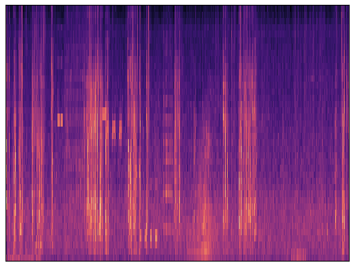

# voice-activity-detector

Trained VAD model utilizing a Convolutional Deep Neural Network Architecture at 92% accuracy on test dataset. 

## Architecture
The CNN architecture has the following notable features:
- Utilizes 4 convolutional layers and 1 fully connected layer for binary classification of a frame of audio as "voiced" or "unvoiced".
- Uses dropout regularization (p = .5) to regulate overfitting. 
- Reduces matrix sizes through max/average pooling
- Model learns 256 unique features

## Data
- The model is trained on the Libriparty dataset, which involes voice-labeled audio data with simulated background noise. The training dataset is about 1250 hours.
- Each recording is converted into a Mel Frequency Spectral Coefficient spectrogram with 40 bands. The MFSC spectrograms are overlaped for every 1/2 frame and fed into the model

Example MFSC spectrogram:
